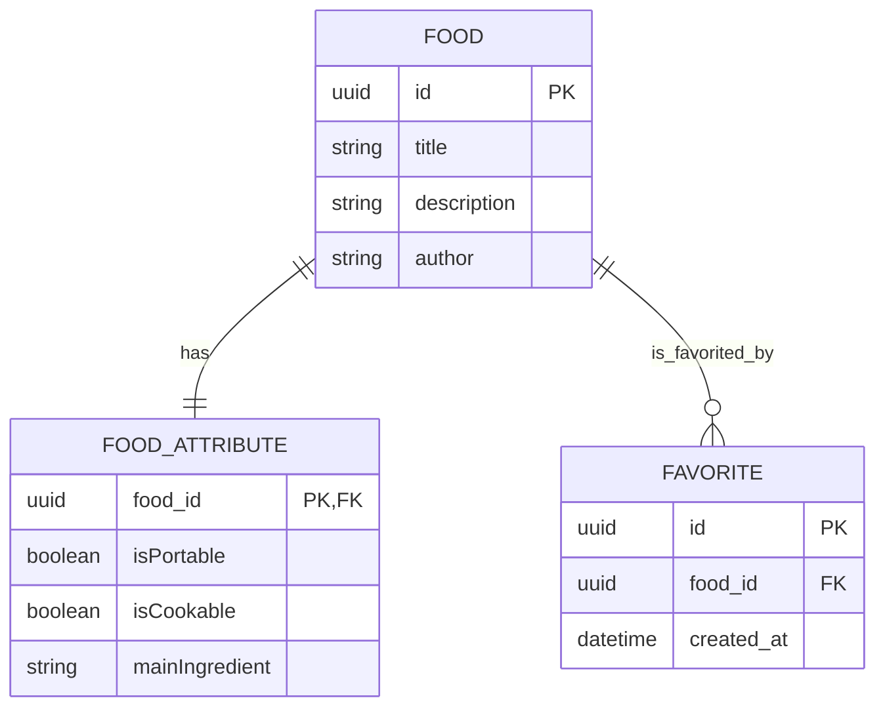
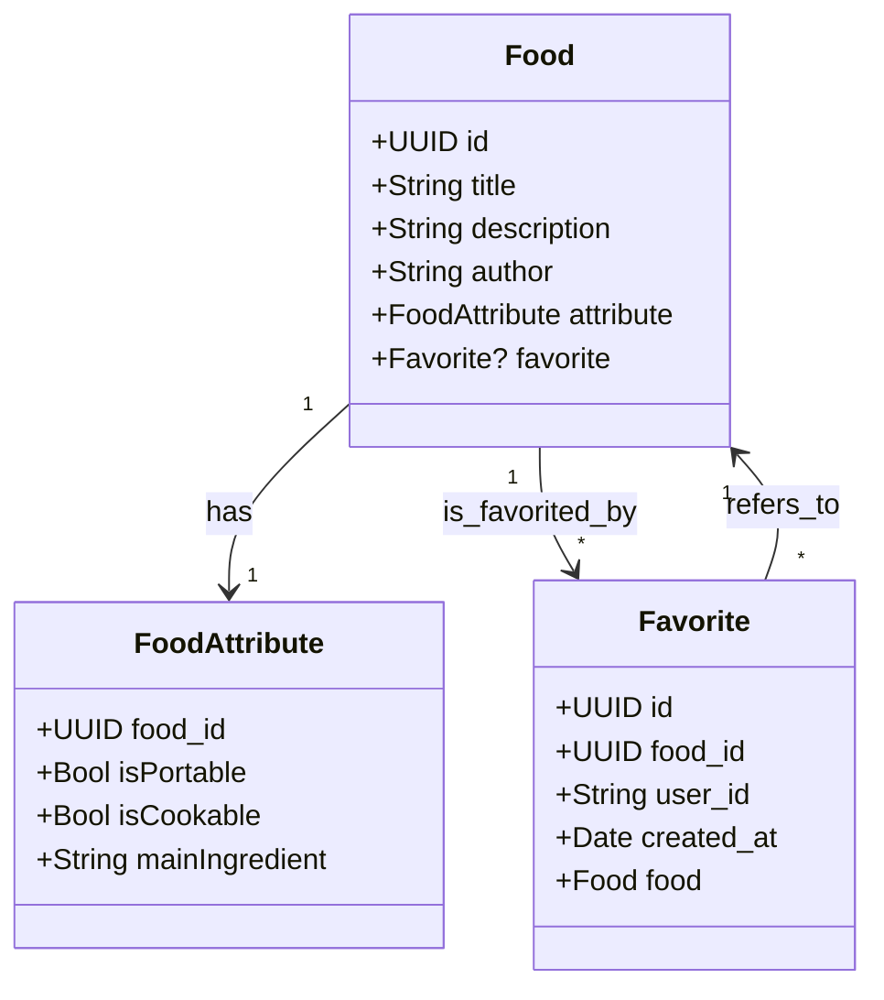

# 데이터 모델

## ERD

```mermaid
erDiagram
    FOOD ||--|| FOOD_ATTRIBUTE : has
    FOOD ||--o{ FAVORITE : is_favorited_by

    FOOD {
        uuid id PK
        string title
        string description
        string author
    }

    FOOD_ATTRIBUTE {
        uuid food_id PK, FK
        boolean isPortable
        boolean isCookable
        string mainIngredient
    }

    FAVORITE {
        uuid id PK
        uuid food_id FK
        datetime created_at
    }
```

## UML

```mermaid
classDiagram
    class Food {
        +UUID id
        +String title
        +String description
        +String author
        +FoodAttribute attribute
        +Favorite? favorite
    }

    class FoodAttribute {
        +UUID food_id
        +Bool isPortable
        +Bool isCookable
        +String mainIngredient
    }

    class Favorite {
        +UUID id
        +UUID food_id
        +String user_id
        +Date created_at
        +Food food
    }

    Food "1" --> "1" FoodAttribute : has
    Food "1" --> "*" Favorite : is_favorited_by
    Favorite "*" --> "1" Food : refers_to
```
